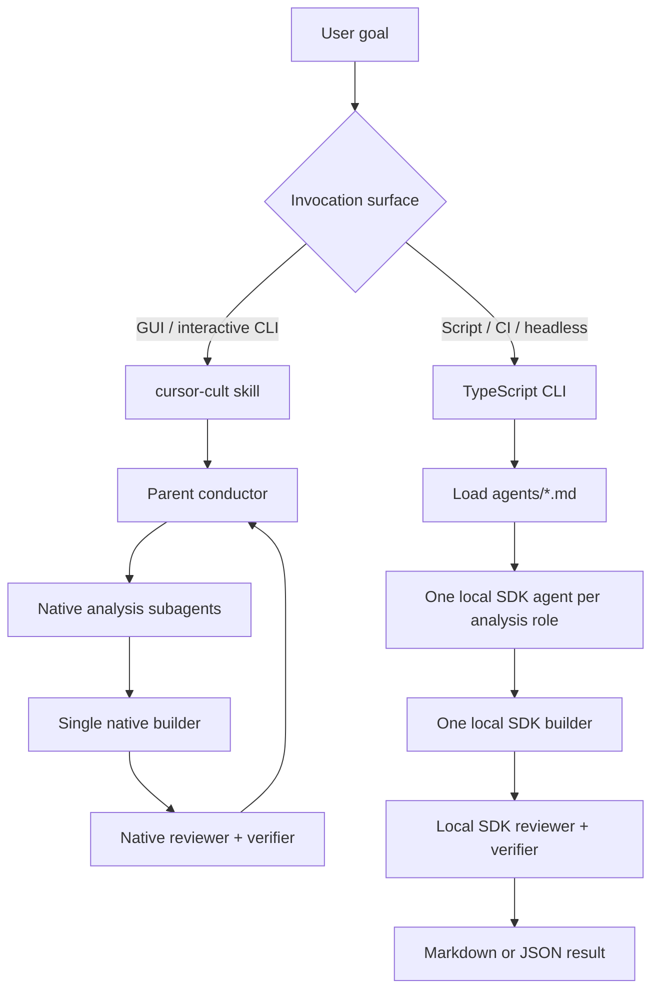

# Cursor Cult design

## Design target

Cursor Cult must behave coherently in three environments:

1. Cursor Agent mode in the desktop GUI.
2. Cursor Agent mode in the interactive CLI.
3. Programmatic local execution through `@cursor/sdk`.

The design preserves one collaboration protocol while allowing the transport to differ where Cursor's current capabilities differ.

## Two transports, one protocol



The role Markdown files are the source of truth for identity, mandate, access posture, and handoff expectations. Native Cursor loads them as custom agents. The SDK runner parses the same frontmatter and prompt body.

## Why the SDK runner creates top-level agents

Cursor SDK v1 exposes custom `agents:` definitions to cloud agents, but local executors currently drop them. A local runner that configured `agents:` and claimed a subagent team would be cosmetically correct and operationally false.

Cursor Cult therefore creates one local `Agent` per role. Every agent receives:

- the same original task;
- its role prompt;
- the same workspace path;
- phase-specific access instructions;
- a structured handoff contract.

This produces real context isolation and parallel execution on the local runtime. It does not create hidden lateral communication; the orchestrator is the sole information bus.

## Phased DAG

```mermaid
flowchart LR
    T[Task model] --> PA[Preflight analysis]
    PA --> S[Scout]
    PA --> A[Architect]
    PA --> X[Specialist(s)]
    PA --> C[Critic]

    S --> I[Integrator / Builder]
    A --> I
    X --> I
    C --> I

    I --> R[Reviewer]
    I --> V[Verifier]
    R --> O[Reconciled result]
    V --> O
```

The default programmatic panel omits `specialist` because a generic specialist needs a precise delegated lens. Callers add it with `--roles ...specialist` when the task provides one, or use native mode where the parent can frame multiple specialist instances dynamically.

## Single-writer invariant

Parallel agents share a workspace in local SDK mode. Concurrent writers would introduce nondeterministic edits, lost updates, test races, and ambiguous ownership. Only the builder receives an edit mandate. Reviewer and verifier run after integration.

This is a coordination rule, not a security boundary. Native Cursor can enforce `readonly: true` on custom agents. The current local SDK runner does not impose an OS-level read-only filesystem or custom tool policy; malicious or disobedient model behavior could still mutate files. Production users should add Cursor permission policy, sandboxing, isolated worktrees, or a custom auto-review layer where stronger enforcement is required.

## Context design

Roles receive a decision-complete brief rather than a raw conversation dump. Every prompt has four layers:

1. stable role identity from `agents/*.md`;
2. shared task and workspace;
3. phase-specific context, such as prior handoffs;
4. evidence, trust, and output contracts.

Role handoffs are full-fidelity strings. The runner does not silently truncate them. Model context windows remain an external limit, so callers should keep the original task and role panel focused.

## Failure semantics

A role failure is data, not an automatic global crash. The runner records:

- phase and role;
- startup versus terminal run failure where available;
- retryability for `CursorAgentError`;
- agent/run IDs;
- duration and token usage when exposed;
- successful handoffs from sibling roles.

The integrator can proceed with partial preflight evidence. Postflight runs only after a successful integration. A transport-level `finished` status does not imply semantic approval; reviewer and verifier verdicts remain explicit in their handoffs. Cancellation is forwarded to active runs when the runtime supports it, followed by agent disposal.

## Model policy

Native roles use stable aliases (`fast` or `inherit`) rather than pinned provider model IDs. The SDK defaults to `{ id: "auto" }`, with `--model` and `CURSOR_CULT_MODEL` overrides. Model catalogs and aliases evolve, so unusual explicit IDs should be checked with Cursor's current model catalog before use.

## Deliberate non-goals in v0.1

- Persistent per-role conversation resume.
- Cloud-agent branch/PR orchestration; Cursor's official `orchestrate` plugin already addresses large cloud task trees.
- Multiple writers in one worktree.
- Automatic semantic parsing of reviewer verdicts into an unbounded repair loop.
- A custom UI or canvas.
- Claiming local SDK custom-subagent support before Cursor ships it.

## Extension points

Likely next steps:

1. Add an opt-in cloud transport using SDK custom `agents:` and isolated branches.
2. Persist role agent IDs per project/session and resume them intentionally.
3. Add permissions or auto-review policies that technically enforce read-only analysis roles.
4. Add a bounded repair round driven by structured reviewer/verifier verdicts.
5. Add a run canvas backed by the JSON result schema.
